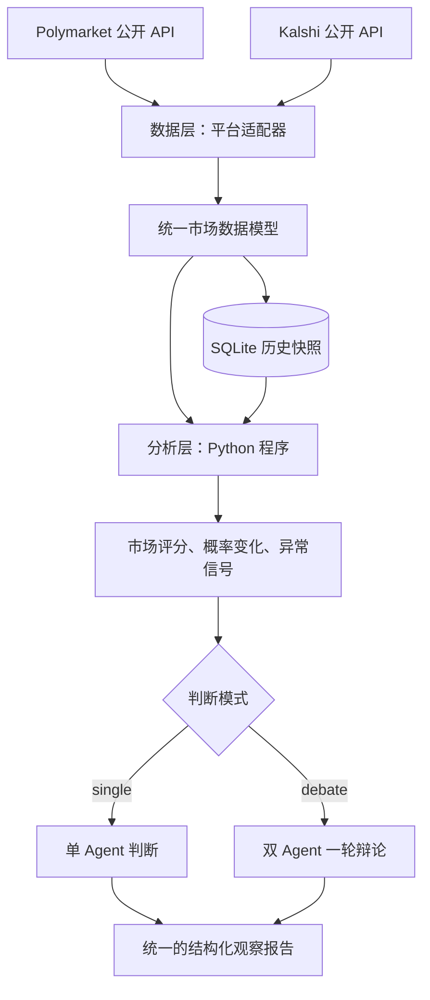

# ARTI：预测市场数据源与分析框架

> 当前状态：第一版已实现。ARTI 使用上层 `agent-development` 的统一 `uv` 项目和 `.env`。

## 运行

从上层目录运行（依赖使用根目录 `pyproject.toml` 和 `.venv`）：

```bash
cd /Users/yxb/OpenAI/agent-development
uv sync
PYTHONPATH=ARTI uv run python -m arti.cli
PYTHONPATH=ARTI uv run pytest -q ARTI/tests
```

日常设置在 [config.json](config.json)：`platforms`、`mode`、`model`、`limit`、`db`、`output`、`jump_pp`、`poll_count`、`interval`。直接编辑该 JSON 后运行上述命令即可。默认 `mode` 为 `none`，结果写入 `ARTI/report.json`，每次运行会覆盖该文件；历史行情另存于 SQLite。密钥只从上层 `.env` 读取，不写入 JSON。命令行参数仍可临时覆盖配置，例如 `PYTHONPATH=ARTI uv run python -m arti.cli --mode single --limit 1`；也可用 `--config /path/to/config.json` 指定另一份配置。报告 JSON 附带本次生效的 `settings`。

`mode=none` 只抓取与分析；`single` 每个合格市场调用一次模型，`debate` 调用四次。模型使用上层 `.env` 中的 `DASHSCOPE_API_KEY`、`DASHSCOPE_BASE_URL`；名称可在配置中指定，命令行 `--model` 可临时覆盖。缺少配置或调用失败时，报告保留数据与分析，并填写 `assessment_error`。默认快照库为 `ARTI/arti.sqlite3`。重复运行后才可能获得 5 分钟、1 小时、24 小时变化；可以配置 `poll_count=2`、`interval=300` 连续采样。`jump_pp` 调整跳变阈值。`limit` 是每个平台**最终选出的市场数**：程序先抓取候选（Kalshi 至少 500 条，Polymarket 至少 100 条），排除无效价格、过旧数据和零成交且价差极宽的市场，再按平台分别评分、排序、选出前 `limit` 条。候选快照也会保存，便于后续比较。

若只检出 ARTI 仓库，仍可不创建子项目环境，从 ARTI 目录用 `uv run --no-project --with 'pydantic>=2' --with 'openai>=3' --with python-dotenv python -m arti.cli --limit 20` 运行。此时 `.env` 仍放在 ARTI 的上层目录，模型模式另加 `--mode` 和 `--model`。测试可在同一命令中把 `python -m arti.cli ...` 换成 `--with pytest pytest -q tests`。

公开 API 是只读的；Kalshi 抓取时排除组合市场，bid/ask 同为 0 且无有效最近价时视为缺少价格。Kalshi 的 `liquidity` 记录最优 YES 买卖报价两侧较小的挂单量（合约数），不把未平仓合约数当作报价深度。抓取失败记录在 `fetch_errors` 与标准错误。首次运行通常显示 `insufficient_history`。部分信号依赖多次等间隔快照。报告仅供研究与人工复核。

首次试跑建议 `--platforms kalshi --limit 1 --mode none`。两个平台的数据抓取并行进行。启用模型后，每个市场的 `single` 有一次模型请求，`debate` 有四次串行请求；默认两个平台各抓取 20 个市场，因而可能耗时很久。命令会在标准错误显示抓取、分析和判断进度。模型请求 30 秒超时且不自动重试；失败记录在该市场的 `assessment_error`。快照在模型判断前保存，因此中断长时间判断也不会丢失本轮行情。

`qwen3.8-*` 结构化判断请求关闭思考模式，以缩短响应时间。提供方的内容审查拒绝会保留在 `assessment_error`，不会生成替代判断。

ARTI 面向 Polymarket 和 Kalshi 的公开预测市场数据。它定期获取市场行情，保存可比较的历史快照，用确定性的程序筛选市场、追踪概率变化并检测异常，最后由可选择的 Agent 工作流汇总证据，形成可追溯的观察结论。

项目借鉴 [TradingAgents](https://github.com/tauricresearch/tradingagents) 将数据分析与最终判断分工、以及让不同立场相互质疑的思路。第一版聚焦预测市场，提供单 Agent 和一轮双 Agent 辩论两种判断模式。

## 总体架构



| 层 | 回答的问题 | 主要输入 | 主要输出 |
| --- | --- | --- | --- |
| 数据层 | 现在每个市场的行情是什么？ | 两个平台的公开 API | 统一市场记录与带时间戳的快照 |
| 分析层 | 哪些市场值得关注，发生了什么变化？ | 当前记录与历史快照 | 关注度评分、概率变化、异常信号及证据 |
| 判断层 | 根据这些证据，应如何理解当前市场？ | 分析结果与数据质量信息 | 单 Agent 或双 Agent 辩论输出结构化结论、证据与风险 |

数据层和分析层产生可复算的事实；判断层负责综合解释。报告是研究与监控结果，不是自动交易指令。

## 1. 数据层：获取、统一、保存

### 数据来源

- **Polymarket**：通过公开市场 API 获取市场标识、问题、状态、结果价格、成交量、流动性和相关时间。适配器负责把结果价格映射到明确的 YES 结果；无法可靠识别 YES 的市场不会被当成二元 YES/NO 市场分析。
- **Kalshi**：通过公开的 `GET /markets` 等市场接口获取 ticker、状态、YES 买卖报价、最近价格、成交量、流动性和结算时间，并处理分页。

实现时会以平台官方文档为字段依据：[Polymarket API 文档](https://docs.polymarket.com/) · [Kalshi Get Markets](https://docs.kalshi.com/api-reference/market/get-markets)。适配器隔离上游字段变化，并记录请求失败、限流和数据缺失情况。

### 统一数据契约

计划采用 Python 3.12、`uv` 和 Pydantic 定义数据模型。关键字段如下：

| 字段 | 含义 |
| --- | --- |
| `market_id` | `platform:原始市场 ID`，避免平台间 ID 冲突 |
| `platform`、`source_id` | 来源平台与平台原始 ID |
| `title`、`status`、`close_time` | 市场问题、状态和截止时间 |
| `yes_probability` | YES 价格隐含的概率，范围为 0–1；不是模型预测概率 |
| `yes_bid`、`yes_ask`、`price_source` | 报价及本次概率采用的价格来源 |
| `volume_total`、`volume_24h`、`volume_unit` | 成交量数值和原始单位 |
| `liquidity`、`liquidity_unit` | 流动性数值和原始单位 |
| `observed_at` | 本系统抓取该记录的 UTC 时间 |
| `source_url` | 原始市场页面或 API 资源，便于复核 |

有效 YES 买卖报价齐全时，优先用中间价 `(bid + ask) / 2` 表示当前价格；否则可使用平台提供的最近成交价或结果价格，并在 `price_source` 中说明。缺失字段保持为空，不以零代替。不同平台成交量和流动性的单位可能不同，跨平台展示时保留单位，不直接用原始值比较大小。

### “实时”与历史

第一版的实时数据指**按可配置间隔轮询公开 API**，不是零延迟行情。每次抓取写入 SQLite 快照，保留市场 ID、价格、成交量、报价和抓取时间。概率变化需要至少两条可比较的历史记录；首次运行只展示当前行情，并标记“历史不足”。抓取时间与平台更新时间分别保留，避免把旧报价误认作新变化。

## 2. 分析层：由 Python 程序计算

分析层使用确定性的计算与规则。同一批输入和同一份配置应产生相同结果；每个指标和信号都保留输入值、时间窗口与阈值。

### 2.1 筛选值得关注的市场

先进行数据质量过滤：排除已关闭市场、无有效 YES 价格、数据过旧或关键字段无法解析的记录。其余市场计算**关注度评分**，主要考虑：

1. 活跃度：近 24 小时成交量，以及可计算时的近期增量。
2. 报价质量：买卖价差和报价完整性。
3. 流动性：平台提供的流动性指标或有效报价深度。
4. 事件时效：距离截止时间是否处于有意义的观察区间。
5. 信息变化：近期概率是否显著移动。

评分用于安排观察优先级，不代表市场被错误定价或存在收益机会。第一版按平台分别排序；若需要跨平台统一排名，须先明确各字段单位与标准化方法。

### 2.2 追踪概率变化

对同一 `market_id` 查找目标时间附近的历史快照，计算百分点变化：

```text
change_pp = (当前 yes_probability - 历史 yes_probability) × 100
```

计划提供 5 分钟、1 小时和 24 小时窗口，同时输出起止概率、实际时间间隔及价格来源。历史快照距离目标时间过远时不计算该窗口，避免将不连续的采样伪装成准确的短时变化。成交量增量仅在相同单位、相同累计口径且数值未重置时计算。

### 2.3 检测异常信号

初版采用可配置规则；阈值是监控参数，需根据实际样本调整：

| 信号 | 检测思路 | 必须附带的证据 |
| --- | --- | --- |
| 概率跳变 | 指定窗口内变化超过阈值 | 起止概率、变化百分点、实际间隔 |
| 成交量激增 | 近期增量显著高于该市场历史基线 | 当前增量、基线、样本量 |
| 低流动性跳变 | 概率大幅变化，但成交或流动性不足 | 概率变化、成交量、流动性 |
| 报价异常 | 买卖价差过宽、报价缺失或数据过旧 | bid、ask、价差、数据时间 |
| 临近截止异动 | 临近截止时出现快速变化 | 剩余时间、概率变化 |

如果历史样本不足，依赖历史基线的信号应显示“无法判断”。多个规则可以同时触发；数据质量问题要随信号一同传给判断层。

## 3. Agent 判断层：两种可选模式

判断层读取分析层的结构化结果，不重新计算概率和成交量。两种模式使用**相同的输入快照与最终输出模型**，区别仅在推理流程：

| 模式 | 流程 | 适用场景 |
| --- | --- | --- |
| `single` | 一个 Agent 直接整理支持证据、反证与风险，输出结论 | 日常批量扫描，调用次数较少 |
| `debate` | 研究 Agent 提议 → 质疑 Agent 反驳 → 研究 Agent 回应 → 质疑 Agent 综合并输出结论 | 对高关注度或信号矛盾的市场做更仔细的复核 |

`debate` 只有**两个角色、四次模型调用、一轮质疑与回应**。质疑 Agent 在最后一步兼任综合判断者，因此这是一种轻量辩论，并非独立第三方裁决；如果后续发现其结论长期偏向保守，再增加独立裁决 Agent。不会用程序规则把双方意见合成为最终状态。

最终结论由 Agent 选择以下状态之一：

- `watch`：持续观察，当前没有足够强的异常证据。
- `investigate`：出现值得人工核查的异动或相互矛盾的信号。
- `avoid`：数据质量或市场风险使当前结论不可靠。
- `insufficient_evidence`：关键输入不足，暂时无法作出上述判断。

### 提示词与输出契约

完整的角色提示词、每轮 user 消息模板、输入模型和输出契约见 [PROMPTS.md](PROMPTS.md)。固定的角色与约束放在 `developer`（或提供方支持的 `system`）消息；本次市场数据和前序发言放在 `user` 消息。XML 仅用于标记消息内部的内容边界。单 Agent 与双 Agent 使用同一个 `AgentAssessment` 输出模型；结构化输出由 API 级 JSON Schema 与 Pydantic 校验共同保障，引用的证据 ID 还需由程序核对。

模型连接和密钥通过配置及环境变量提供；未配置模型或调用失败时，保留数据层与分析层结果，并明确标记判断未生成，不使用规则程序代替 Agent 作最终判断。LLM 生成的解释可能不稳定，因此原始指标、触发规则和（在辩论模式下）每轮发言始终随报告保存，供人复核。

## 报告数据结构示例

以下是**示意输出**，不是实际 API 抓取结果：

```json
{
  "market_id": "kalshi:EXAMPLE",
  "observed_at": "2026-09-24T08:00:00Z",
  "yes_probability": 0.62,
  "price_source": "bid_ask_midpoint",
  "analysis": {
    "attention_score": 78,
    "changes": {
      "15m_pp": 9.0,
      "1h_pp": 11.0
    },
    "signals": [
      {
        "id": "signal:probability_jump:15m",
        "type": "probability_jump",
        "severity": "high",
        "evidence": {
          "change_pp": 9.0,
          "window_minutes": 15,
          "threshold_pp": 8.0
        }
      }
    ],
    "data_quality": "adequate"
  },
  "assessment": {
    "mode": "single",
    "as_of": "2026-09-24T08:00:00Z",
    "status": "investigate",
    "summary": "短时间内 YES 价格明显上升，需要结合成交与报价继续核查。",
    "supporting_evidence": ["signal:probability_jump:15m"],
    "counter_evidence": [],
    "open_questions": ["成交量是否同步增长？"],
    "cited_signals": ["signal:probability_jump:15m"],
    "risks": ["价格变化不等于事件结果已经确定"]
  }
}
```

## 项目结构

```text
ARTI/
├── arti/
│   ├── adapters/              # Polymarket、Kalshi 数据接入
│   ├── models.py              # 统一数据与报告模型
│   ├── storage.py             # SQLite 快照
│   ├── analysis/              # 筛选、概率变化、异常规则
│   ├── decision/              # XML prompt、单 Agent / 双 Agent 编排、输出校验
│   └── cli.py                 # 抓取与分析入口
└── tests/                    # 固定样本与分析规则测试
```

## 实施顺序与验收

1. 使用上层统一 `uv` 项目，建立统一模型和两个公开 API 适配器。
2. 保存快照，实现市场筛选、概率追踪和异常检测。
3. 按 [PROMPTS.md](PROMPTS.md) 实现单 Agent 与一轮双 Agent 辩论，使用分角色消息、XML 分段内容和统一的结构化输出校验。
4. 用固定样本测试字段转换和分析计算，再对公开 API 做只读连通性检查。
5. 补充可实际运行的安装、命令和样例，并发布 GitHub。

已用固定样本验证字段转换、快照窗口与结构化输出引用，并对两个公开 API 完成只读连通性检查。模型不可用时只输出数据与分析结果，明确标记判断未生成。

## 边界

本项目不执行交易，也不根据标题自动认定两个平台的市场对应同一事件。市场价格反映交易者报价，不能直接视为经验证的真实概率。报告用于数据研究和人工复核。
