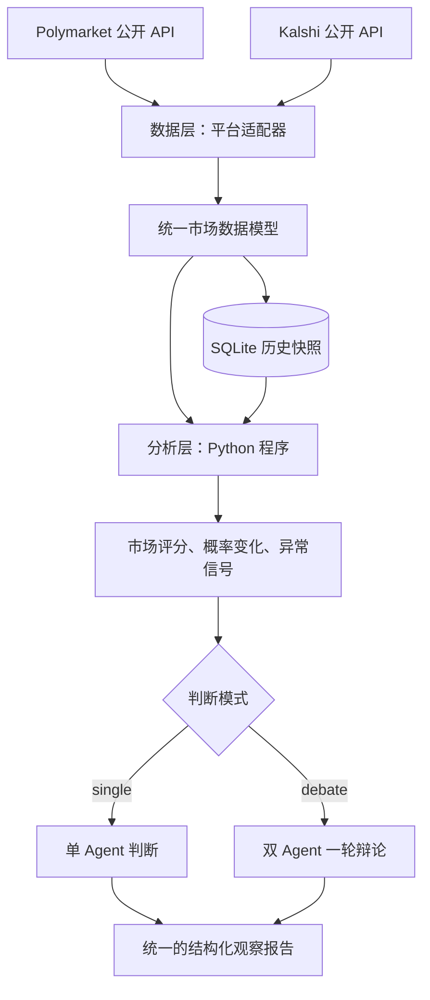

# ARTI：预测市场监测与证据分析

从 Polymarket 和 Kalshi 的公开 API 抓取预测市场行情，保存 SQLite 历史快照，计算价格变化和异常信号，并可用单 Agent 或一轮双 Agent 辩论生成可复核的观察报告。它只读取公开数据，不执行交易，也不自动认定两个平台的市场对应同一事件。

## 安装与运行

需要 Python 3.12 或更新版本，以及 [uv](https://docs.astral.sh/uv/)。在项目目录执行：

```bash
uv sync
uv run arti
```

默认使用仓库中的 `config.example.json`，抓取两个平台的数据，只做程序分析。结果写入 `report.json`，历史快照写入 `arti.sqlite3`。仓库中的 `report.json` 是一份真实运行示例；再次运行会覆盖它。SQLite 数据库仅保存在本地。

需要修改日常设置时，复制一份本地配置：

```bash
cp config.example.json config.json
```

编辑 `config.json` 即可。若选择 `single` 或 `debate` 模式，还需复制脱敏的环境变量模板并填写自己的百炼密钥和工作空间地址：

```bash
cp .env.example .env
uv run arti
```

`.env` 和 `config.json` 都不会提交到 Git。密钥只放在 `.env`，不要写入配置或报告。可以用命令行临时覆盖配置，例如 `uv run arti --platforms kalshi --mode single --limit 1`。`uv run arti --help` 可查看所有参数。

## 配置

| 字段 | 作用 | 示例默认值 |
| --- | --- | --- |
| `platforms` | 要抓取的平台，可选一个或两个 | `polymarket`, `kalshi` |
| `mode` | `none` 只分析；`single` 每市场一次模型调用；`debate` 每市场四轮调用 | `none` |
| `model` | 百炼模型名称 | `qwen3.8-flash` |
| `limit` | 每个平台最终选入报告的市场数上限 | `5` |
| `db` | SQLite 快照文件路径，相对于项目目录 | `arti.sqlite3` |
| `output` | JSON 报告路径，相对于项目目录 | `report.json` |
| `jump_pp` | 概率跳变阈值，单位为百分点 | `8` |
| `poll_count` | 连续抓取轮数 | `1` |
| `interval` | 多轮抓取间隔，单位为秒 | `300` |

报告文件每次运行会覆盖；SQLite 快照持续积累。设置 `poll_count > 1` 时，程序在两轮之间等待 `interval` 秒。首次抓取通常缺少可比较历史；持续采样后才会出现 5 分钟、1 小时和 24 小时的变化指标。

## 总体架构



| 层 | 回答的问题 | 主要输入 | 主要输出 |
| --- | --- | --- | --- |
| 数据层 | 现在每个市场的行情是什么？ | 两个平台的公开 API | 统一市场记录与带时间戳的快照 |
| 分析层 | 哪些市场值得关注，发生了什么变化？ | 当前记录与历史快照 | 关注度评分、概率变化、异常信号及证据 |
| 判断层 | 根据这些证据，应如何理解当前市场？ | 分析结果与数据质量信息 | 单 Agent 或双 Agent 辩论输出结构化结论、证据与风险 |

数据层和分析层产生可复算的事实；判断层负责综合解释。报告是研究与监控结果，不是自动交易指令。

## 1. 数据层：获取、统一、保存

### 数据来源

- **Polymarket**：通过公开市场 API 获取市场标识、问题、状态、结果价格、成交量、流动性和相关时间。适配器负责把结果价格映射到明确的 YES 结果；无法可靠识别 YES 的市场不会被当成二元 YES/NO 市场分析。
- **Kalshi**：通过公开的 `GET /markets` 等市场接口获取 ticker、状态、YES 买卖报价、最近价格、成交量、流动性和结算时间，并处理分页。组合市场在抓取时排除。

字段转换参考平台官方文档：[Polymarket API 文档](https://docs.polymarket.com/) · [Kalshi Get Markets](https://docs.kalshi.com/api-reference/market/get-markets)。适配器隔离上游字段变化，并记录请求失败、限流和数据缺失情况。

### 统一数据契约

项目使用 Python 3.12、`uv` 和 Pydantic 定义数据模型。关键字段如下：

| 字段 | 含义 |
| --- | --- |
| `market_id` | `platform:原始市场 ID`，避免平台间 ID 冲突 |
| `platform`、`source_id` | 来源平台与平台原始 ID |
| `title`、`status`、`close_time` | 市场问题、状态和截止时间 |
| `yes_probability` | YES 价格隐含的概率，范围为 0–1；不是模型预测概率 |
| `yes_bid`、`yes_ask`、`price_source` | 报价及本次概率采用的价格来源 |
| `volume_total`、`volume_24h`、`volume_unit` | 成交量数值和原始单位 |
| `liquidity`、`liquidity_unit` | 流动性数值和原始单位 |
| `observed_at` | 本系统抓取该记录的 UTC 时间 |
| `source_url` | 原始市场页面或 API 资源，便于复核 |

有效 YES 买卖报价齐全时，优先用中间价 `(bid + ask) / 2` 表示当前价格；否则可使用平台提供的最近成交价或结果价格，并在 `price_source` 中说明。缺失字段保持为空，不以零代替。不同平台成交量和流动性的单位可能不同，跨平台展示时保留单位，不直接用原始值比较大小。

### “实时”与历史

这里的实时数据指**按可配置间隔轮询公开 API**，不是零延迟行情。每次抓取写入 SQLite 快照，保留市场 ID、价格、成交量、报价和抓取时间。概率变化需要至少两条可比较的历史记录；首次运行只展示当前行情，并标记“历史不足”。抓取时间与平台更新时间分别保留，避免把旧报价误认作新变化。

## 2. 分析层：由 Python 程序计算

分析层使用确定性的计算与规则。同一批输入和同一份配置产生相同结果；信号保留其证据值；涉及时间窗口与阈值时一并记录。

### 2.1 筛选值得关注的市场

先进行数据质量过滤：排除已关闭市场、无有效 YES 价格、数据过旧或关键字段无法解析的记录。其余市场计算**关注度评分**，主要考虑：

1. 活跃度：近 24 小时成交量及近期活跃度。
2. 报价质量：买卖价差和报价完整性。
3. 流动性：平台提供的流动性指标或有效报价深度，并保留原始单位。
4. 事件时效：距离截止时间是否处于有意义的观察区间。
5. 信息变化：近期概率是否显著移动。

评分用于安排观察优先级，不代表市场被错误定价或存在收益机会。市场按平台分别排序；跨平台原始成交量和流动性没有统一单位，因此不混合排名。

### 2.2 追踪概率变化

对同一 `market_id` 查找目标时间附近的历史快照，计算百分点变化：

```text
change_pp = (当前 yes_probability - 历史 yes_probability) × 100
```

提供 5 分钟、1 小时和 24 小时窗口，同时输出起止概率、实际时间间隔及价格来源。历史快照距离目标时间过远时不计算该窗口，避免将不连续的采样伪装成准确的短时变化。成交量增量仅在相同单位、相同累计口径且数值未重置时计算。

### 2.3 检测异常信号

规则阈值是监控参数，可根据实际样本调整：

| 信号 | 检测思路 | 必须附带的证据 |
| --- | --- | --- |
| 概率跳变 | 指定窗口内变化超过阈值 | 起止概率、变化百分点、实际间隔 |
| 成交量激增 | 近期增量显著高于该市场历史基线 | 当前增量、基线、样本量 |
| 低流动性跳变 | 概率大幅变化，但成交或流动性不足 | 概率变化、成交量、流动性 |
| 报价异常 | 买卖价差过宽、报价缺失或数据过旧 | bid、ask、价差或数据时间 |
| 临近截止异动 | 临近截止时出现快速变化 | 剩余时间、概率变化 |

如果历史样本不足，依赖历史基线的信号应显示“无法判断”。多个规则可以同时触发；数据质量问题要随信号一同传给判断层。

## 3. Agent 判断层：两种可选模式

判断层读取分析层的结构化结果，不重新计算概率和成交量。两种模式使用**相同的输入快照与最终输出模型**，区别仅在推理流程：

| 模式 | 流程 | 适用场景 |
| --- | --- | --- |
| `single` | 一个 Agent 直接整理支持证据、反证与风险，输出结论 | 日常批量扫描，调用次数较少 |
| `debate` | 研究 Agent 提议 → 质疑 Agent 反驳 → 研究 Agent 回应 → 质疑 Agent 综合并输出结论 | 对高关注度或信号矛盾的市场做更仔细的复核 |

`debate` 只有**两个角色、四次模型调用、一轮质疑与回应**。质疑 Agent 在最后一步兼任综合判断者，因此这是一种轻量辩论，并非独立第三方裁决。不会用程序规则把双方意见合成为最终状态。

最终结论由 Agent 选择以下状态之一：

- `watch`：持续观察，当前没有足够强的异常证据。
- `investigate`：出现值得人工核查的异动或相互矛盾的信号。
- `avoid`：数据质量或市场风险使当前结论不可靠。
- `insufficient_evidence`：关键输入不足，暂时无法作出上述判断。

### 提示词与输出契约

完整的角色提示词、每轮 user 消息模板、输入模型和输出契约见 [PROMPTS.md](PROMPTS.md)。固定的角色与约束放在 `developer` 消息；本次市场数据和前序发言放在 `user` 消息。XML 仅用于标记消息内部的内容边界。单 Agent 与双 Agent 使用同一个 `AgentAssessment` 输出模型；结构化输出由 API 级 JSON Schema 与 Pydantic 校验共同保障，引用的证据 ID 还需由程序核对。

模型连接和密钥通过配置及环境变量提供；未配置模型或调用失败时，保留数据层与分析层结果，并明确标记判断未生成，不使用规则程序代替 Agent 作最终判断。LLM 生成的解释可能不稳定，因此原始指标、触发规则和（在辩论模式下）每轮发言始终随报告保存，供人复核。

## 报告结构

仓库中的 [report.json](report.json) 是一次真实的 `debate` 模式运行结果，包含 Kalshi 和 Polymarket 各一条市场记录，以及每个市场前三轮发言和最终判断。每次运行会覆盖该文件；如需保留示例，可在本地配置中修改 `output` 路径。报告包含：

- `settings`：本次生效的非敏感配置。
- `reports`：各选中市场的行情、程序分析、模型判断或 `assessment_error`。辩论前三轮保存在 `debate_turns`，最后结论保存在 `assessment`；中途失败时，已校验的轮次仍会保留。
- `skipped_assessments`：模型提供方因内容审查拒绝的市场及原因。程序最多再尝试三个候选补足 `limit`。
- `fetch_errors`：公开 API 的抓取错误。

公开 API 或模型服务可能超时、限流或拒绝输入；这些情况会在报告中明确标记。市场价格是交易报价隐含的概率，不代表事件已被证实。模型也不会查询新闻或外部事实。

## 项目结构

```text
ARTI/
├── .env.example          # 脱敏的模型服务配置模板
├── config.example.json   # 可提交的运行配置示例
├── pyproject.toml         # 独立包与命令入口
├── uv.lock                # 锁定依赖
├── PROMPTS.md             # Agent 角色、提示词和输出契约
├── README.md
├── report.json            # 真实运行结果示例
├── arti/
│   ├── adapters.py        # Polymarket、Kalshi 数据接入
│   ├── models.py          # 统一数据与报告模型
│   ├── storage.py         # SQLite 快照
│   ├── analysis.py        # 市场评分、概率变化、异常规则
│   ├── decision.py        # 单 Agent / 双 Agent 编排与输出校验
│   └── cli.py             # 抓取与分析入口
└── tests/test_arti.py     # 固定样本和判断流程测试
```

## 测试

```bash
uv run pytest -q
```

固定样本测试覆盖平台字段转换、快照窗口、异常规则、候选筛选、证据 ID 校验和辩论失败时的发言保存。测试使用模拟模型响应，不调用真实模型。平台接口参考：[Polymarket 文档](https://docs.polymarket.com/) · [Kalshi Get Markets](https://docs.kalshi.com/api-reference/market/get-markets)。

## 边界

本项目不执行交易，也不根据标题自动认定两个平台的市场对应同一事件。市场价格反映交易者报价，不能直接视为经验证的真实概率。报告用于数据研究和人工复核。
